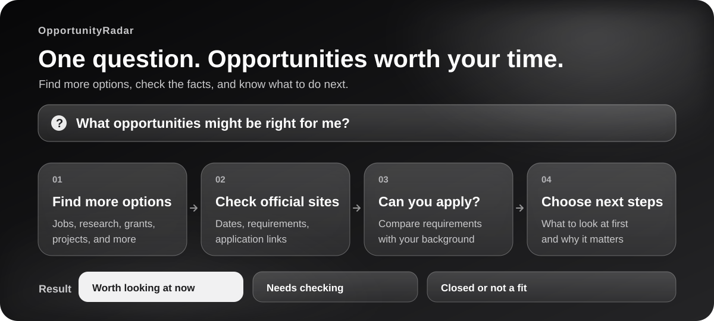

<div align="center">

[简体中文](./README.md) · **English**

# OpportunityRadar

**Find the opportunities you didn't know to search for.**

Ask what to do next. Get a shortlist that explains what fits, what is open, and what is worth your time.

[](https://github.com/Sver0411/OpportunityRadar/actions/workflows/test.yml)
[](LICENSE)

</div>

You cannot apply to an opportunity you never found. And you cannot trust a deadline just because a job board still shows it.

OpportunityRadar helps a web-enabled agent search beyond your first keywords, check promising leads on official pages, and tell you which ones you can act on. It is built to answer the useful question: **“What should I look at next, and why?”**

## More than a list of links

| What you need | What the skill does |
|---|---|
| **More options** | Search across 13 categories, including jobs, research, funding, open source, and projects—without adding irrelevant categories to a focused request. |
| **Facts you can check** | Use third-party pages to find leads, then check important claims against official sources. Unconfirmed details are labelled as such. |
| **A clear eligibility answer** | Compare stated requirements with what you have actually shared. If something is missing, say what needs checking. |
| **A useful order** | Put deadlines and application status alongside fit, so you know what needs attention first. |
| **Less repetition** | Optional local files keep track of what you have seen or saved and flag important changes. |

The goal is not the longest list. It is a short list you can understand and use.

## When to use it

Ask a personal question, not a database query:

```text
I'm studying graphic design and want a project with a real portfolio outcome. What should I explore?

I care about public health and data. What research or community programmes might be a fit?

I'm considering an exchange programme abroad. Which options are worth checking, and what do you need to know about me?
```

You can change direction mid-conversation. A preference for local jobs in one turn should not quietly rule out overseas graduate study in the next. The current request guides that search without rewriting your longer-term profile.

The skill is intended for students, recent graduates, and early-career explorers in any field—not just software engineers. It can look across 13 opportunity categories, from internships and research to competitions, scholarships, exchange programmes, open source, events, and creative projects. A narrow request stays narrow; breadth is useful only when it uncovers something genuinely relevant.

## Every lead has to earn its place

Each result should answer a few practical questions:

1. **Why this?** How does it connect to your background or goal?
2. **Can I apply?** Which requirements are confirmed, and which are still unknown?
3. **Is it current?** Is there a verified application window or deadline?
4. **Where did that come from?** Can you inspect the official source yourself?

OpportunityRadar separates **ready to consider now**, **promising but unconfirmed**, and **closed or clearly ineligible** leads. A listing on a job board can start the search; it doesn't, by itself, prove that a programme is still accepting applicants. Missing information stays missing instead of becoming a confident guess. If only a few leads survive the checks, only a few make the shortlist.

This distinction matters in easy-to-miss cases. Next year's graduate intake may already be recruiting. A master's programme awards a master's degree; that does not mean applicants must already hold one. The skill keeps cohort, application timing, current qualifications, and target degree separate.

## What you get for each lead

A useful recommendation should tell you more than where to click. Expect the official name and organiser, why it matches your goal, whether you appear eligible, the latest confirmed application details, and the point that still needs your attention. If the official page does not confirm a requirement, the answer should say so rather than fill in the blank.

That makes a short list more useful than a long one. A lead with an unclear deadline belongs in a “needs checking” group; an expired one should not be presented as something you can apply to today.

You can help the agent narrow the search by mentioning a target region, whether remote options work for you, and any firm limits on time or cost. You do not need a polished profile to begin. If a missing fact would change the answer, the skill should identify it instead of guessing.

## Install

Place this repository in the skills directory of an Agent Skills-compatible host. The installed folder must be named `opportunity-radar`. For a personal Codex installation, for example:

```bash
mkdir -p ~/.codex/skills
git clone https://github.com/Sver0411/OpportunityRadar.git ~/.codex/skills/opportunity-radar
```

Then ask your agent a question like those above. Automatic activation depends on the host's Skill support. Discovery needs a host that can search the web and read pages; without those capabilities, the agent cannot verify live opportunities.

The command above is for a first installation. If you already have an `opportunity-radar` folder, update that installation according to your host's setup rather than cloning over it.

The helper scripts use only the Python standard library. Python 3.8+ enables repeatable date parsing, deduplication, scoring, and optional local state. Without Python, the agent can still follow the written protocol, but should say that those checks were done manually. The skill has no application-submission workflow and does not need its own account or service token.

## A small protocol, not a static list

The agent builds a search from your goals and location, checks official sources, compares eligibility against facts you actually supplied, and ranks the surviving options. It can also surface an adjacent path you may not have considered—say, a funded research project next to a conventional internship search—without padding the answer with weak matches.

The rules live in [`SKILL.md`](SKILL.md). The rest of the repository supports them:

| Path | What it contributes |
|---|---|
| [`references/`](references/) | Focused guidance on search, source quality, eligibility, regions, and answer format. |
| [`scripts/`](scripts/) | Deterministic checks for dates, duplicates, ranking, and local history. |
| [`schemas/`](schemas/) | Shared fields for profiles and opportunity records, including evidence. |
| [`examples/`](examples/) | Fictional data for demonstrations; not live opportunities. |

If you want to inspect the implementation, see [`DEVELOPMENT.md`](DEVELOPMENT.md). Run the repository checks with `python3 -m unittest discover -s tests -t tests`.

## Limits worth knowing

This is a discovery aid, not a complete registry of openings. Opportunities change, so re-open the official page before acting. Ambiguous eligibility can require human judgement or one more detail from you. Optional history is kept in local `.opportunity-radar/` files; the helper scripts do not upload it. Applications, emails, registrations, and personal-data uploads remain separate actions.

Licensed under [MIT](LICENSE).
