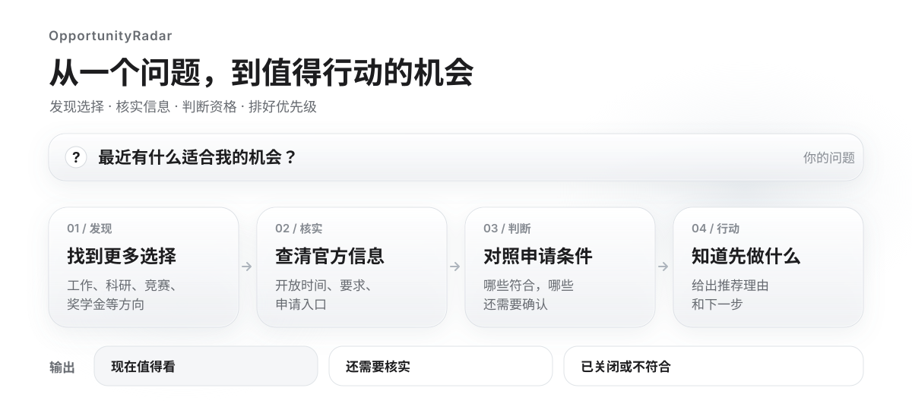

<div align="center">

**简体中文** · [English](./README.en.md)

# OpportunityRadar

### 把「我接下来能做什么？」变成一组经过核实、可以解释、能够行动的机会决策。

**Find the opportunities you didn't know to search for.**

[](https://github.com/Sver0411/OpportunityRadar/actions/workflows/test.yml)
[](SKILL.md)
[](scripts/)
[](scripts/)
[](LICENSE)

**发现未知机会 · 回到官方来源 · 判断真实资格 · 解释投入价值 · 连接下一次跃迁**

</div>

---

很多机会并不是竞争失败，而是从未进入你的视野。

普通搜索要求你先知道关键词；OpportunityRadar 处理的恰恰是更难的那个问题：

> **当我还不知道该搜什么时，怎样找到真正适合我、现在仍然有效，而且值得投入的机会？**

OpportunityRadar 是一个面向 Agent 的 **Personal Opportunity Intelligence Skill**。它把零散的网页搜索升级成一条完整决策链：理解一个人所处的阶段与目标，展开可能的搜索空间，从多语言、多地区来源中发现候选，回到官方页面核实，再判断资格、准备度、投入产出与未来通道。

最终交付的不是一堵链接墙，而是一组有证据、有取舍、有下一步的机会组合。

## 从搜索结果，到机会智能


它覆盖职业、科研、竞赛、教育、语言、技能发展、开源、兴趣、资助、活动、项目、创业与社群网络等 **13 类机会**。搜索可以很宽，也可以很窄：开放性问题会主动探索用户可能没想到的方向；明确说“只看远程开源”时，系统不会为了显得丰富而塞入无关结果。

## 为什么它不只是「帮我搜一下」

### 1. 它会寻找你不知道该如何命名的机会

用户说出的往往是目标，而不是正确的搜索词。

“我想积累研究经历”背后可能对应实验室项目、开放课题、学术志愿者、产业联合研究、暑研、研讨会或开源研究工具；“我想做出作品”也不只意味着课程，还可能是企业命题、公益项目、开源贡献、创意竞赛或社区协作。

OpportunityRadar 从目标、兴趣、阶段、地区和约束构建搜索空间，并保留一部分预算寻找 **Adjacent / Explore** 方向——因为真正有价值的结果，常常不是用户一开始就会输入搜索框的那个词。

### 2. 每条重要结论都要经过证据门槛

第三方平台适合发现线索，不适合替官方页面证明事实。

一条机会想进入“现在值得行动”，至少要经得起几道检查：

- **Freshness Gate**：这一轮是否仍开放，还是已经过期、结束或尚未开始？
- **Canonical Source Gate**：是否找到了具体的官方项目页，而不只是聚合站或机构首页？
- **Evidence Gate**：申请状态、截止时间和资格要求是否有可追溯证据？
- **Eligibility Gate**：学历、年级、毕业窗口、语言、地点等硬条件是否存在明确冲突？
- **Resource Gate**：时间、成本或个人 dealbreaker 是否让它事实上不可执行？

找不到证据时，结果会保留为 **Unknown**，而不是被语言模型补成一个听起来合理的答案。

### 3. 它把三个经常混在一起的问题彻底分开

| 决策层 | 回答的问题 | 为什么必须分开 |
|---|---|---|
| **Match** | 它和我有多匹配？ | 很匹配，不代表现在最急。 |
| **Priority** | 它是否需要优先处理？ | 快截止，不代表值得投入。 |
| **Utility** | 它现在值得占用我的资源吗？ | 高匹配机会也可能成本过高、准备周期过长。 |

OpportunityRadar 不展示“83.7214 分”式的伪精确结论，也不预测录取概率。它输出 High / Medium / Low / Unknown，并告诉你这个判断由哪些事实构成。

### 4. 它关心机会之后还会发生什么

好的机会不只解决眼前问题，还会改变下一次选择的集合。

OpportunityRadar 会描述一条可追踪的链路：

```text
当前缺口
   ↓
可以参与的 Bridge Opportunity
   ↓
可公开验证的产出（PR / 作品 / 论文 / 演讲 / 项目经历）
   ↓
被打开的后续机会类型
   ↓
长期目标
```

如果后续机会尚未真实发现，系统只记录它的类型，不编造一个不存在的项目 ID。没有合适的外部 Bridge 时，也会明确说“本轮没有找到”，而不是拿课程列表填空。

### 5. 它给出 Portfolio，而不是机械 Top N

人的时间和预算是有限的。一份看似优秀、合计却需要每周 30 小时的推荐，对每周只能投入 6 小时的人没有意义。

OpportunityRadar 会在资源约束下组织机会：

- **Now**：现在就值得处理；
- **Bridge**：能补关键缺口；
- **Low-cost**：投入小、适合快速试错；
- **High-upside**：难度更高，但上限可观；
- **Long-term**：为未来积累能力或资本；
- **Explore**：用户可能不会主动搜索的方向。

角色只有达标才出现，不会为了凑齐栏目塞入弱结果；当已知投入超过预算时，系统会直接报告资源冲突。

## 你最终会得到什么

OpportunityRadar 把结果分成三个清晰区域：

| 区域 | 含义 |
|---|---|
| **Recommended now** | 官方来源、近期状态和关键证据已核实，没有已知硬冲突。 |
| **Worth verifying** | 有潜力，但开放状态、来源或资格仍有关键未知项。 |
| **Closed / Excluded** | 已结束、已过期或存在明确冲突，并附排除原因。 |

每条核心推荐都会尽量回答：

```text
为什么是它？      与你的目标、兴趣或现有能力有什么连接
你能参与吗？      哪些资格已确认，哪些仍是 Unknown
现在开放吗？      当前周期与申请入口是否有官方证据
要投入什么？      每周时间、准备复杂度、成本与阻塞项
会留下什么？      作品、公开贡献、证书、网络或研究证据
接下来打开什么？  官方页面，以及最值得先确认的一件事
```

一个简化后的输出可能长这样：

```text
主线：Open Source Mentorship
为什么：目标高度相关，可留下公开 PR，并能补足真实协作经历
参与状态：官方页面已核实；当前开放
资格：Probably Eligible — 学历满足，时区要求仍需确认
准备度：Minor preparation — 需要补一份英文项目简介
投入：约 5h / 周；在你的 6h / 周预算内
未来价值：公开贡献 → Maintainer / Internship / Research Collaboration
下一步：打开官方项目列表，先确认 mentor 与 issue 的匹配度
```

> 上面的内容只是格式示意，不代表当前存在或开放的真实机会。

## 谁适合使用

OpportunityRadar 不把“机会”理解成只有招聘岗位。它适用于正在寻找下一步的人，例如：

- 想找科研、竞赛、交换、奖学金或实习的学生；
- 想建立作品集、公开贡献或行业网络的应届生与职场新人；
- 正在晋升、转岗、转行或重返职场的人；
- 想寻找公开课题、合作项目、社群与演讲机会的研究者或资深从业者；
- 尚未形成明确目标，希望用低成本实验探索方向的人。

你不需要先填写一张完整表格。一句话就可以开始：

```text
我是视觉设计专业的学生，最近有什么能留下真实作品的项目？

我在做嵌入式开发，想转向 Edge AI，现在最值得补什么、参加什么？

我暂时不想找工作，想用每周 5 小时做点能打开新方向的事情。

我准备申请海外研究生，有哪些项目能验证方向，也能补研究经历？

我不知道自己下一步想做什么，帮我找几种差异足够大的尝试。
```

系统会先用已有信息启动搜索，只在缺失项确实会改变结论时再追问。学校所在地、过往搜索和当前请求也不会被悄悄混成同一个偏好。

## 快速开始

将仓库放进支持 Agent Skills 的宿主的 skills 目录，最终目录名应为 `opportunity-radar`。

以 Codex 个人安装为例：

```bash
mkdir -p ~/.codex/skills
git clone https://github.com/Sver0411/OpportunityRadar.git ~/.codex/skills/opportunity-radar
```

然后直接用自然语言提问。Skill 是否会自动启用，取决于宿主对 Agent Skills 的支持。

运行完整发现流程时，宿主需要能够搜索网页并读取页面。仓库中的确定性辅助脚本使用 Python 3.8+，只依赖标准库；没有 Python 时仍可按照 [`SKILL.md`](SKILL.md) 执行协议，但日期、去重、评分与状态管理会退化为人工判断。

已有安装请在原目录中更新，不要用 `git clone` 覆盖现有文件。

## 设计原则

OpportunityRadar 的复杂度主要用来约束系统，而不是包装输出。

- **Hard constraints outrank vibes**：明确硬条件高于模型的主观“感觉合适”。
- **Unknown stays Unknown**：用户没说，不等于没有；页面没写，不等于满足。
- **Official facts first**：搜索结果负责发现，官方来源负责确认。
- **Eligibility ≠ Readiness**：有资格申请，不代表已经准备好开始。
- **Evidence over confidence**：越重要的结论，越需要可追溯依据。
- **No padding**：没有足够好的结果，就少推荐；不为数量牺牲质量。
- **Current request is context**：本轮偏好影响本轮搜索，不会偷偷重写长期画像。
- **Reversible by default**：发现、分析和解释属于流程；投递、报名、发信和上传个人资料不在其中。

更完整的判断纪律、执行模式和 13 步工作流见 [`SKILL.md`](SKILL.md)。

## 项目结构

仓库刻意保持轻量：协议负责推理，脚本负责把容易漂移的判断变成可重复执行的检查。

```text
OpportunityRadar/
├── SKILL.md          # Skill 入口：触发条件、完整工作流与执行纪律
├── references/       # 搜索、来源、资格、排序、地区与输出规范
├── scripts/          # 日期、去重、评分、证据、Utility、Graph、Portfolio 等工具
├── schemas/          # Profile 与 Opportunity 的结构化契约
├── examples/         # 虚构示例数据，不可作为真实机会引用
├── tests/            # 一致性、回归、契约与 CLI 测试
├── benchmarks/       # 多 persona 基准与历史质量记录
└── usertests/        # 端到端验证记录
```

几个关键模块：

| 模块 | 作用 |
|---|---|
| [`scripts/score.py`](scripts/score.py) | 硬约束、Match、Priority、推荐分区与质量门槛。 |
| [`scripts/evidence.py`](scripts/evidence.py) | 官方来源与申请状态的证据前置检查。 |
| [`scripts/readiness.py`](scripts/readiness.py) | 判断离真正开始还有多远，而不是预测录取概率。 |
| [`scripts/utility.py`](scripts/utility.py) | 结合价值、投入、成本、准备度与未来通道判断 Utility。 |
| [`scripts/graph.py`](scripts/graph.py) | 连接 produces → unlocks，以及 gap → bridge。 |
| [`scripts/portfolio.py`](scripts/portfolio.py) | 在每周时间预算下构建机会组合。 |
| [`scripts/presentation.py`](scripts/presentation.py) | 把结构化结论翻译成克制、清晰、面向用户的表达。 |

共享枚举和规则集中在 [`scripts/common.py`](scripts/common.py)，Schemas、References 与实现之间的漂移由测试自动检查。更多架构取舍见 [`DEVELOPMENT.md`](DEVELOPMENT.md)。

## 工程质量

这个项目不依赖“提示词看起来很聪明”来证明可靠性。仓库提供：

- 单元测试、回归测试、跨文件一致性测试与 CLI smoke tests；
- Profile / Opportunity JSON Schema；
- 多角色 benchmark 与端到端 user-test 记录；
- 对过期机会、未核实开放状态、资源冲突、画像串线和伪精确表达的专门防护；
- 一条命令完成编译、测试与 Skill package 校验的预检流程。

```bash
python3 scripts/preflight.py
```

CI 同时覆盖 Python 3.8 与 Python 3.12。示例数据均为虚构内容；真实机会必须在实际运行时重新搜索和核实。

## 边界与隐私

机会会变化，任何重要决定都应在行动前重新打开官方页面确认。OpportunityRadar 不保证扫描整个互联网，也不保证申请结果；它提供的是更系统的发现、更严格的证据纪律和更透明的决策依据。

可选画像、已见过、收藏、忽略和申请状态保存在本地 `.opportunity-radar/`。辅助脚本不会主动上传这些文件。Skill 不会自行提交申请、发送邮件、注册账号或上传个人资料。

## License

[MIT](LICENSE) © OpportunityRadar contributors
