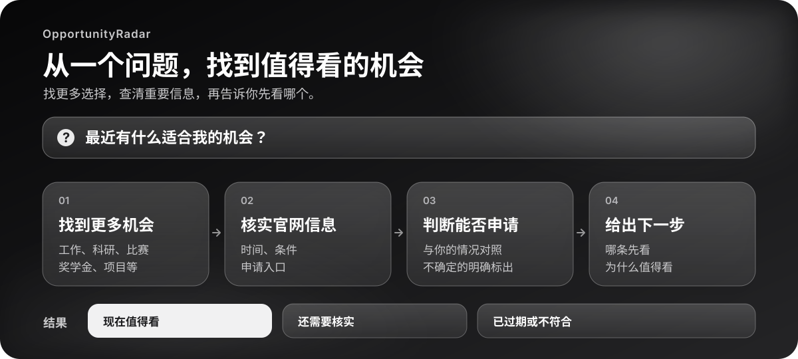

<div align="center">

**简体中文** · [English](./README.en.md)

# OpportunityRadar

**不知道该搜什么？让 AI 把值得争取的机会找出来。**

从工作、科研到比赛和资助，不止帮你找，还帮你查清楚：**适不适合、能不能申请、现在该先看哪个。**

[](https://github.com/Sver0411/OpportunityRadar/actions/workflows/test.yml)
[](LICENSE)

</div>

> 很多机会错过了，不是因为不够努力，而是因为你根本不知道它存在。

OpportunityRadar 让 Agent 不再只搜你给出的几个关键词。它会根据你的背景和目标继续找相关方向，回到官方页面核实报名时间和申请要求，最后挑出真正值得你花时间看的机会。**你问的是“我能做什么”，得到的不该只是一页链接。**

## 它比“帮我搜搜”多做什么？

| 你需要的 | OpportunityRadar 会做的 |
|---|---|
| **找到更多可能** | 不只搜工作和实习，也会找科研、竞赛、开源、升学、奖学金、项目等 13 类机会。你只想看某一类时，就不乱推荐。 |
| **核实是不是真的** | 招聘平台和论坛可以提供线索；截止时间、申请要求等重要信息要回官方页面确认。没查到，就明确告诉你没查到。 |
| **判断你能不能申请** | 逐项对照学历、毕业时间、语言、地点等条件。能确定的给出依据，不能确定的告诉你还缺什么。 |
| **告诉你先看哪个** | 同样适合的两个机会，快截止的可能更该先处理；过期或明显不符合的直接排除。 |
| **下次不用从头来** | 如果启用本地记录，会记住已展示、收藏或忽略的机会；重要信息变了，也能再提醒你。 |

**它追求的不是把列表做长，而是让你一眼看懂：哪几条值得现在点开，为什么。**

## 你会看到怎样的结果

结果会分清楚，不把已过期、还没核实和现在可关注的机会混在一起：

| 结果 | 你该怎么理解 |
|---|---|
| **现在值得看** | 官方来源与近期申请信息已核实，没有已知的硬性资格冲突；附上为什么推荐和该注意什么。 |
| **值得继续核实** | 看起来有潜力，但开放状态、申请条件或来源还没查清；告诉你具体查什么。 |
| **已关闭 / 不符合** | 过期或存在明确冲突，直接说明原因，省下无效搜索时间。 |

它也会留意容易搞错的细节：毕业届别不等于报名年份，项目授予的学位不等于申请人已有的学历。本轮从“本地实习”切到“远程开源”，结果会跟着转向，而不会悄悄覆盖长期偏好。

## 一条推荐不应该只有名字和网址

一条有用的推荐，至少要回答下面这些问题：

```text
这是什么机会？       官方名称和主办方是谁
为什么推荐给我？     哪些要求或方向与你吻合
我能申请吗？         哪些条件已确认，哪些还不知道
现在还能申请吗？     报名时间与官方页面是否核实过
接下来做什么？       先打开哪个页面，重点检查什么
```

因此，即使同一批候选里有很多链接，最终也可能只留下几条。没核实的内容不会被写得像事实；明明已经过期的机会也不会混进“现在值得看”。

## 试着这样问

```text
我是视觉设计专业的学生，最近有哪些能做出作品的比赛或项目？

我对公共卫生和数据分析都感兴趣，有没有我可能没想到的科研或志愿项目？

我想申请海外交换项目。哪些条件已经能判断，哪些还需要我补充？

我暂时不找工作，有没有适合做进作品集的项目、比赛或开源计划？
```

不需要先填一张完整表格。你给出阶段、方向、地区等几条线索，它就能开始；真正会影响结论的缺项，再向你追问。

如果你有明确限制，也可以直接说出来，例如“只看远程”“每周最多投入几小时”或“只考虑有资助的项目”。如果暂时没有目标，就说出你感兴趣的领域和最近想尝试的事，Skill 会从多个方向找起。它不会把你没说过的技能、成绩或语言水平当成已知事实。

## 安装与使用

把仓库放进支持 Agent Skills 的宿主的 skills 目录，**最终目录名必须是 `opportunity-radar`**。例如 Codex 的个人安装：

```bash
mkdir -p ~/.codex/skills
git clone https://github.com/Sver0411/OpportunityRadar.git ~/.codex/skills/opportunity-radar
```

在其他宿主中，按该宿主的 Skill 安装方式放置同一个目录即可。安装后直接用自然语言提问；是否能自动启用，取决于宿主对 Agent Skills 的支持。

如果你已经在其他目录安装过旧版，先确认安装位置，再按那个宿主的方式更新；上面的 `git clone` 命令适合首次安装，不会覆盖已有目录。

发现和核实真实机会需要宿主能够联网搜索、打开页面。本 Skill 的辅助脚本只用 Python 标准库，不需要额外 API Key；没有 Python 时仍可按 [`SKILL.md`](SKILL.md) 中的流程工作，但日期、去重和评分改为人工判断。脚本不替你投递、报名或联系机构。

## 它是怎么判断的

核心流程可以概括为：**理解你的目标 → 扩大搜索方向 → 找到候选 → 回官方页面核实 → 判断资格与时效 → 排序并解释**。

其中有几条底线：

- 页面明确写了“仅限博士”，就不能因为研究方向很合适而推荐给本科生。
- 你没提供语言成绩，不等于你没有；项目没写语言要求，也不等于它没有要求。
- “项目很适合你”和“现在应该先申请”是两件事；临近截止的真实机会可能更值得先处理。
- 找不到足够好的结果，就少推荐几条，不拿未经核实的链接凑数。

详细规则在 [`SKILL.md`](SKILL.md)。它覆盖 13 类机会；完整分类和各地搜索用语放在 [`references/`](references/) 中，需要时才加载。

## 仓库里有什么

| 位置 | 用途 |
|---|---|
| [`SKILL.md`](SKILL.md) | Agent 何时启用、如何搜索与判断，以及最终推荐的门槛。 |
| [`references/`](references/) | 画像、来源、资格、排序和地区差异等详细规则。 |
| [`scripts/`](scripts/) | 日期解析、去重、评分与本地状态等可重复执行的辅助程序。 |
| [`schemas/`](schemas/) | 用户画像和机会记录的数据格式。 |
| [`examples/`](examples/) | 供演示用的虚构数据；**不能当作真实机会引用**。 |

想看维护说明与设计取舍，请读 [`DEVELOPMENT.md`](DEVELOPMENT.md)。仓库测试可用 `python3 -m unittest discover -s tests -t tests` 运行。

## 使用边界

机会会变化。即使一次核实过，临近投递时也应再打开官方页面确认。来源不足、条件模糊或你尚未提供关键信息时，Skill 会保留不确定性；它不能保证搜遍所有机构，也不会代你提交申请或上传个人资料。

可选的画像和“已见过”记录保存在本地 `.opportunity-radar/`，不会由辅助脚本上传到服务端。许可证见 [MIT](LICENSE)。
